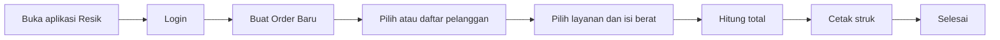
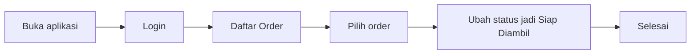
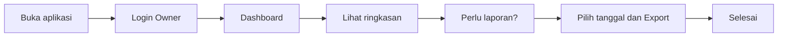
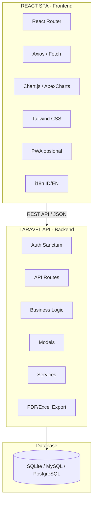
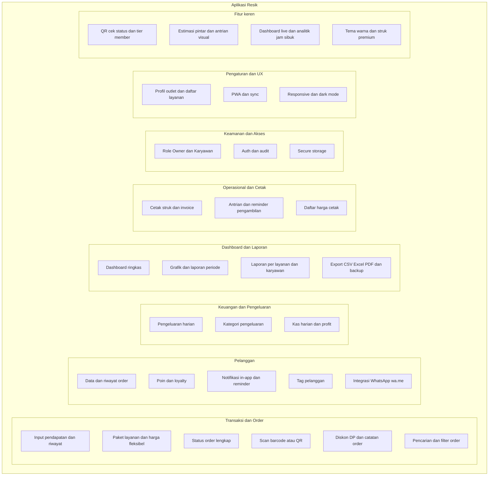
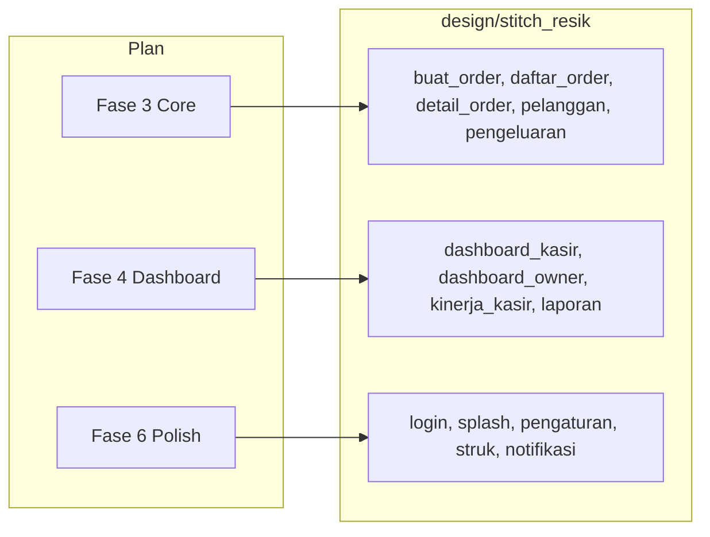

# Resik — Dokumentasi Lengkap (Laravel + React)

**Rangkuman dokumentasi pengguna, rencana pengembangan, dan integrasi desain untuk aplikasi manajemen laundry Resik.** Stack: **Laravel** (backend API) + **React** (frontend SPA). Single outlet, tanpa API berbayar.

---

# BAGIAN 1: Panduan untuk Pengguna

## Apa itu Resik?

**Resik** adalah aplikasi web untuk mengurus usaha laundry dari satu outlet. Dipakai lewat browser (HP Android/iPhone atau komputer Windows/Mac). Dengan Resik Anda bisa:

- Mencatat order cucian baru dengan cepat
- Menyimpan data pelanggan
- Mencetak struk untuk pelanggan (bisa pakai QR untuk cek status)
- Melihat pendapatan dan pengeluaran
- Membuat laporan untuk keperluan arsip atau pajak
- Login dengan password (di web); bisa disesuaikan untuk PWA/HP

Semua data disimpan di server. Aplikasi responsive dan bisa diakses dari mana saja selama terhubung internet. Mode offline bisa ditambahkan dengan PWA (Progressive Web App).

---

## Untuk siapa?

| Peran | Kegiatan sehari-hari |
| ----- | --------------------- |
| **Pemilik (Owner)** | Cek ringkasan usaha, lihat grafik pendapatan/pengeluaran, buat laporan periode, export ke PDF/Excel, atur jenis layanan dan harga. |
| **Kasir / Karyawan** | Login, buat order baru, cetak struk, ubah status order (misalnya jadi "siap diambil"), catat pengeluaran harian. |

---

## Apa saja yang bisa dilakukan?

- **Order baru:** input nama/telepon pelanggan, pilih layanan (cuci, setrika, kiloan, dll.), isi berat atau jumlah, sistem hitung total, cetak struk.
- **Daftar order:** lihat semua order, filter menurut tanggal atau status, ubah status (diterima → cuci → setrika → siap diambil → diambil).
- **Pelanggan:** simpan data pelanggan, lihat riwayat order per pelanggan.
- **Pengeluaran:** catat pengeluaran harian (listrik, detergen, dll.) per kategori.
- **Dashboard (owner):** ringkasan hari ini / minggu / bulan: jumlah order, pendapatan, pengeluaran, profit.
- **Laporan:** laporan per periode, per layanan, atau per karyawan; export ke PDF atau Excel.
- **Cetak:** struk untuk pelanggan, invoice, daftar harga.
- **Notifikasi:** pengingat di dalam aplikasi (misalnya order siap diambil).
- **WhatsApp:** link chat ke pelanggan (wa.me, tanpa biaya tambahan).
- **Fitur keren:** scan QR di struk untuk cek status order, tier member (Bronze/Silver/Gold), estimasi selesai pintar, dashboard live, analitik (jam sibuk, layanan laris), tema warna outlet, struk & invoice premium.

### Fitur keren — ringkas

- **QR di struk** — Pelanggan scan QR untuk cek status order lewat browser.
- **Tier member** — Bronze / Silver / Gold; makin sering order, makin dapat benefit.
- **Referral** — Kode referral untuk diskon atau poin.
- **Ulang tahun pelanggan** — Diskon atau ucapan di hari ulang tahun.
- **Estimasi pintar** — Perkiraan "Siap jam berapa" berdasarkan jenis layanan.
- **Antrian visual** — Kartu order per status.
- **Quick action** — Satu ketuk: cetak struk, ubah status, buka WhatsApp.
- **Dashboard live** — Ringkasan order dan pendapatan real-time.
- **Analitik** — Grafik jam sibuk, layanan laris, pelanggan aktif.
- **Tema & struk premium** — Warna sesuai branding, logo outlet.
- **Multi-bahasa** — Indonesia atau English.

---

## Cara pakai — langkah singkat

### Kasir: menerima order baru

1. Buka aplikasi Resik di browser.
2. Login (email + password).
3. Pilih **Buat Order Baru**.
4. Pilih pelanggan atau daftarkan pelanggan baru.
5. Pilih layanan dan isi berat/jumlah.
6. Sistem menghitung total.
7. Cetak struk dan berikan ke pelanggan.
8. Order tercatat di sistem.

**Diagram alur:**



### Kasir: mengubah status order

1. Buka **Daftar Order**.
2. Cari order yang sudah dicuci/disetrika.
3. Ubah status menjadi **Siap Diambil**.
4. Pelanggan bisa diberi tahu (notifikasi di app atau struk pengambilan).

**Diagram alur:**



### Owner: melihat ringkasan dan laporan

1. Login sebagai **Owner**.
2. Buka **Dashboard** — ringkasan hari ini.
3. Pilih tanggal, lalu **Export** ke PDF atau Excel.
4. File laporan bisa disimpan untuk arsip atau keperluan lain.

**Diagram alur:**



---

## FAQ Pengguna

| Pertanyaan | Jawaban |
| ---------- | ------- |
| Di mana data disimpan? | Di server aplikasi. Bisa di-backup (export CSV/Excel) ke Google Drive/dll. |
| Bisa dipakai tanpa internet? | Dengan PWA bisa di-cache untuk penggunaan terbatas offline. Sinkronisasi saat online. |
| Siapa yang bisa buat order? | Semua karyawan dengan akun kasir. Owner mengatur akses. |
| Hubungi pelanggan lewat WhatsApp? | Ada link wa.me untuk chat ke nomor pelanggan (gratis). |
| Ada biaya langganan/API? | Tidak. Semua fitur tanpa layanan berbayar untuk operasional harian. |

**Ringkasan panduan:** Resik = aplikasi untuk mengurus laundry (order, pelanggan, struk, pengeluaran, laporan) plus fitur keren. Dipakai oleh pemilik dan kasir/karyawan. Bisa dipakai di HP dan komputer lewat browser. Dengan PWA bisa offline terbatas; tanpa biaya API untuk fitur utama.

Untuk pertanyaan teknis atau panduan instalasi, hubungi pengembang atau lihat dokumen teknis yang disediakan.

---

# BAGIAN 2: Rencana Teknis (Laravel + React)

## Konteks

- **Stack:** **Laravel** (backend API) + **React** (frontend SPA). Satu codebase web, deploy sebagai aplikasi web responsive.
- **Scope:** Satu laundry (single outlet), role: Owner + Karyawan.
- **Pembanding:** Edobi; Resik dirancang lebih unggul di fitur, UX, dan fleksibilitas platform.
- **Batasan:** Tidak ada API berbayar. Semua fitur memakai open-source, layanan gratis, atau kemampuan standar web.

---

## Arsitektur Laravel + React



- **Frontend:** React SPA (create-react-app, Vite, atau Laravel + Inertia + React).
- **Backend:** Laravel API (auth dengan Sanctum, CRUD, laporan, export PDF/Excel).
- **Opsi deploy:** Vercel/Netlify (frontend) + hosting PHP/Laravel (backend); atau Laravel + Inertia + React di satu server.

---

## Tanpa API Berbayar — Pilihan Gratis

| Kebutuhan | Opsi yang dipakai (gratis) |
| --------- | --------------------------- |
| Frontend | React (open-source), Tailwind CSS |
| Build & hosting | Vite/build lokal; deploy ke Vercel/Netlify atau shared hosting |
| Database | SQLite / MySQL / PostgreSQL (self-hosted) |
| Auth | Laravel Sanctum (API token) |
| Grafik & laporan | Chart.js / ApexCharts (open-source), Dompdf / barryvdh untuk PDF |
| Email | Laravel Mail + SMTP gratis (Gmail, dll.) |
| Backup | Export CSV/JSON + simpan manual |
| WhatsApp | Link wa.me (gratis) |

---

## Fitur Edobi (pembanding)

- Input pendapatan & riwayat transaksi
- Data pelanggan di cloud
- Pantauan real-time owner ke transaksi karyawan
- Kontrol akses pegawai (role)
- Pencatatan pengeluaran harian
- Cetak struk Bluetooth
- Tanggal transaksi & tanggal pengambilan
- Integrasi WhatsApp (notifikasi/chat ke pelanggan)

**Total: 8 area fitur, 1 platform (Android).**

---

## Fitur Resik — Lebih Banyak dari Edobi

Resik mencakup **semua yang Edobi punya** plus puluhan fitur tambahan, tetap **tanpa API berbayar**.

### Diagram fitur Resik



**Platform:** Semua fitur tersedia di web responsive (HP, tablet, desktop).

### Transaksi & order

- Input pendapatan & riwayat transaksi (seperti Edobi)
- **Paket layanan** (cuci, setrika, cuci+setrika, express, kiloan, satuan) dengan harga per paket
- **Harga fleksibel** per berat (kiloan) atau per item (satuan)
- **Estimasi selesai** otomatis berdasarkan jenis layanan
- **Status order** lengkap: diterima → cuci → setrika → siap diambil → diambil / batal
- **Scan barcode/QR** (kamera browser / input manual) untuk cari order atau pelanggan
- **Diskon & promo**: diskon per order, kupon, harga member
- **Uang muka (DP)** dan pencatatan sisa pembayaran
- **Catatan khusus** per order (komplain, request pelanggan)
- **Pencarian & filter** order: tanggal, status, pelanggan, nomor order

### Pelanggan

- Data pelanggan tersimpan
- **Riwayat order** per pelanggan
- **Poin / loyalty** (opsional): kumpul poin, tukar diskon
- **Notifikasi in-app & reminder**: order siap, reminder pengambilan, belum bayar
- **Tag pelanggan** (member, langganan, dll.) untuk filter dan laporan
- **Integrasi WhatsApp**: link **wa.me** (gratis); opsional WhatsApp Business API (percakapan layanan 24 jam bisa gratis)

### Keuangan & pengeluaran

- Pencatatan **pengeluaran harian** (seperti Edobi)
- **Kategori pengeluaran** (listrik, detergen, gaji, dll.)
- **Kas harian**: pemasukan vs pengeluaran per hari
- **Profit per periode** (hari/minggu/bulan) dan per layanan

### Operasional & cetak

- **Cetak struk** (browser print / PDF download); share ke pelanggan
- **Template struk** dan **invoice** (nama outlet, alamat, detail order)
- **Antrian order** dan **reminder pengambilan** (notifikasi in-app)
- **Daftar harga** (bisa cetak untuk pajang di outlet)

### Keamanan & akses

- **Role akses**: Owner vs Karyawan (seperti Edobi)
- **Laravel Sanctum** untuk auth API
- **Audit ringan**: siapa buat/ubah order (user_id)

### Pengaturan & UX

- **Profil outlet**: nama, alamat, no. telepon (untuk struk & invoice)
- **Pengaturan daftar layanan** dan harga
- **PWA** (opsional): cache untuk offline terbatas, sync saat online
- **Responsive**: HP, tablet, desktop
- **Dark mode / tema** (opsional)
- **Shortcut keyboard** (desktop) untuk akses cepat

### Fitur keren (nilai tambah)

| Area | Contoh fitur |
| ---- | ------------ |
| **Pelanggan & branding** | QR cek status, tier member, referral, ulang tahun pelanggan, **foto kondisi baju** (sebelum/sesudah) |
| **Operasional & UX** | Estimasi pintar, antrian visual, quick action, dashboard live, **notifikasi desktop** (Web Notifications API) |
| **Analitik** | Jam sibuk, layanan laris, pelanggan aktif, **prediksi sederhana** (perkiraan pendapatan minggu ini) |
| **Tampilan** | Tema warna, struk premium, **animasi & transisi**, multi-bahasa |

### Tabel jumlah fitur

| Kategori | Edobi | Resik |
| -------- | ----- | ----- |
| Transaksi & order | 2 | 10+ |
| Pelanggan | 1 | 6+ |
| Keuangan & pengeluaran | 1 | 4+ |
| Dashboard & laporan | 1 | 6+ |
| Operasional & cetak | 1 | 4+ |
| Keamanan & akses | 1 | 4+ |
| Pengaturan & UX | 0 | 6+ |
| **Fitur keren** | 0 | 15+ |
| Platform | 1 (Android) | Web (semua device) |

### Tabel Edobi vs Resik (unggul)

| Aspek | Edobi | Resik (lebih banyak) |
| ----- | ----- | -------------------- |
| **Transaksi** | Input pendapatan, riwayat | + paket layanan, status order, scan barcode/QR, diskon/DP, catatan order, filter & cari |
| **Pelanggan** | Data di cloud | + history order, poin/loyalty, notifikasi in-app, tag pelanggan, wa.me / Business API |
| **Keuangan** | Pengeluaran harian | + kategori pengeluaran, kas harian, profit per periode & per layanan |
| **Kontrol owner** | Pantau real-time | + dashboard analitik, grafik, laporan periode/per layanan/per karyawan, export CSV/Excel/PDF |
| **Operasional** | Struk Bluetooth | + template struk & invoice, antrian, reminder pengambilan, daftar harga cetak |
| **Keamanan** | Role akses | + audit siapa input order |
| **Ketersediaan** | Cloud only | PWA + sync (offline terbatas) |
| **Platform** | Android only | Web responsive (HP, tablet, desktop) |

---

## Struktur Project (Laravel + React)

```
Resik/
├── app/
│   ├── Models/           # User, Customer, Order, OrderItem, OrderStatus, ServicePackage, Expense, ExpenseCategory, OutletSetting
│   ├── Http/Controllers/ # API Controllers
│   ├── Services/         # OrderService, ReportService, ExportService, SyncService, NotificationService
│   └── ...
├── config/
├── database/migrations/
├── design/
│   ├── stitch_resik/     # Mockup HTML per layar (referensi UI)
│   │   ├── dashboard_kasir_resik/
│   │   ├── buat_order_baru/
│   │   ├── daftar_order/
│   │   └── ...
│   └── prompt_stitch_mobile.md
├── resources/
│   └── js/               # React components (jika Inertia) atau frontend terpisah
├── routes/
│   ├── web.php
│   └── api.php
├── package.json          # React, Vite, Tailwind, Chart.js, dll.
├── composer.json
└── README.md
```

- **Auth:** Laravel Sanctum untuk API token; Breeze/Jetstream opsional untuk scaffolding.
- **UI React:** Implementasi mengacu ke mockup di `design/stitch_resik/` untuk konsistensi.

---

## Skema Database

### Model dan Tabel Utama

| Model | Tabel | Keterangan |
| ----- | ----- | ---------- |
| User | users | Akun owner/karyawan |
| Customer | customers | Data pelanggan |
| ServicePackage | service_packages | Layanan (cuci, setrika, kiloan, dll.) |
| OrderStatus | order_statuses | Status order (diterima → diambil) |
| Order | orders | Order utama |
| OrderItem | order_items | Detail layanan per order (multi-layanan) |
| ExpenseCategory | expense_categories | Kategori pengeluaran |
| Expense | expenses | Pengeluaran harian |
| OutletSetting | outlet_settings | Pengaturan outlet (key-value) |

### Diagram Relasi (ERD)

```mermaid
erDiagram
    users ||--o{ orders : "created_by"
    users ||--o{ expenses : "created_by"
    customers ||--o{ orders : "has"
    service_packages ||--o{ order_items : "in"
    orders ||--|{ order_items : "contains"
    orders }o--|| order_statuses : "status"
    expense_categories ||--o{ expenses : "categorized"
    
    users {
        bigint id PK
        string name
        string email UK
        string password
        enum role
        timestamps
    }
    
    customers {
        bigint id PK
        string name
        string phone
        string email
        enum member_tier
        int points
        date birthday
        timestamps
    }
    
    orders {
        bigint id PK
        string order_number UK
        bigint customer_id FK
        bigint status_id FK
        bigint created_by FK
        decimal total
        decimal paid
        decimal discount
        text notes
        datetime estimate_ready_at
        datetime taken_at
        timestamps
    }
    
    order_items {
        bigint id PK
        bigint order_id FK
        bigint service_package_id FK
        decimal quantity
        decimal unit_price
        decimal subtotal
        timestamps
    }
    
    order_statuses {
        bigint id PK
        string name UK
        int sort_order
    }
    
    service_packages {
        bigint id PK
        string name
        enum type
        decimal price_per_unit
        string unit
        int estimate_minutes
        timestamps
    }
    
    expenses {
        bigint id PK
        bigint expense_category_id FK
        bigint created_by FK
        decimal amount
        date expense_date
        text description
        timestamps
    }
    
    expense_categories {
        bigint id PK
        string name
        timestamps
    }
    
    outlet_settings {
        bigint id PK
        string key UK
        text value
        timestamps
    }
```

### Tabel dan Kolom Detail

**users:** id, name, email (unique), password, role (enum: owner, karyawan), timestamps

**customers:** id, name, phone, email (nullable), address (nullable), member_tier (enum: bronze, silver, gold, nullable), points (default 0), birthday (nullable), referral_code (nullable unique), tags (json nullable), timestamps

**service_packages:** id, name, type (enum: kiloan, satuan, paket), price_per_unit (decimal), unit (kg/pcs), estimate_minutes (integer), is_active (boolean default true), timestamps

**order_statuses:** id, name (unique: diterima, cuci, setrika, siap_diambil, diambil, batal), sort_order, color (nullable). *Seed: 6 status default.*

**orders:** id, order_number (unique, auto: ORD-YYYYMMDD-001), customer_id (FK), status_id (FK), created_by (FK users, nullable), total, paid (default 0), discount (default 0), notes (nullable), estimate_ready_at (nullable), taken_at (nullable), timestamps

**order_items:** id, order_id (FK), service_package_id (FK), quantity, unit_price, subtotal, timestamps

**expense_categories:** id, name, timestamps. *Seed: kategori default (listrik, detergen, gaji, dll.)*

**expenses:** id, expense_category_id (FK), created_by (FK users, nullable), amount, expense_date, description (nullable), timestamps

**outlet_settings:** id, key (unique), value (text/JSON), timestamps. *Contoh key: outlet_name, address, phone, theme_primary, logo_path, whatsapp_enabled*

### Urutan Migrasi

1. users
2. order_statuses
3. expense_categories
4. customers
5. service_packages
6. outlet_settings
7. orders (FK: customer_id, status_id, created_by)
8. order_items (FK: order_id, service_package_id)
9. expenses (FK: expense_category_id, created_by)

### Indeks yang Disarankan

- **orders:** order_number (unique), customer_id, status_id, created_at, estimate_ready_at
- **customers:** phone, member_tier, referral_code
- **expenses:** expense_date, expense_category_id
- **order_items:** order_id, service_package_id

### Opsi Tambahan (Fitur Lanjutan)

| Fitur | Tabel/kolom tambahan |
| ----- | -------------------- |
| Audit trail | audits (user_id, action, model, changes) |
| Notifikasi | notifications (user_id, type, data, read_at) |
| Foto kondisi baju | order_photos (order_id, photo_path, type: before/after) |
| Kupon/promo | coupons + order_coupons (order_id, coupon_id, discount) |

---

## Referensi Desain UI (design/stitch_resik)

UI mengacu pada mockup HTML di `design/stitch_resik/`. Setiap subfolder = satu layar; file `code.html` berisi mockup (Tailwind, dark mode, font Inter, primary `#0da6f2`). React components sebaiknya mengacu ke mockup yang sama.

| Mockup (folder) | Layar / tujuan |
| ---------------- | -------------- |
| `resik_splash_screen_premium_typography` | Splash / loading |
| `login_screen_modern_cool` | Login |
| `dashboard_kasir_resik` | Dashboard kasir |
| `dashboard_owner_with_leaderboard` | Dashboard owner |
| `buat_order_baru` | Form buat order baru |
| `daftar_order` | Daftar order (filter, quick action) |
| `detail_order_premium_qr_redesign` | Detail order + QR status |
| `daftar_pelanggan` | Daftar pelanggan (tier member) |
| `pengeluaran` | Form + list pengeluaran |
| `pengaturan` | Pengaturan outlet, layanan, tema |
| `digital_receipt_rupiah_format` | Struk digital (format Rupiah) |
| `laporan_pdf_via_whatsapp` | Laporan PDF + share WhatsApp |
| `notifikasi_transaksi_whatsapp_owner_view` | Notifikasi transaksi (owner) |
| `detail_kinerja_kasir` | Detail kinerja kasir |

Brief desain: `design/prompt_stitch_mobile.md` (navigasi bawah, tap ~44pt, status warna).

---

## Fase Implementasi (High-Level)

1. **Setup Laravel + React**
   - Laravel API (routes, Sanctum auth).
   - React SPA (Vite/Inertia) atau frontend terpisah.

2. **Data & auth**
   - Migrasi: users (role), customers, service_packages, order_statuses, orders, order_items, expense_categories, expenses, outlet_settings.
   - Sanctum auth, policy (owner vs karyawan).

3. **Core flows (React + API)**
   - CRUD pelanggan, buat order (paket, status, berat, estimasi, DP, diskon).
   - Riwayat transaksi, filter, pengeluaran + kategori.
   - UI mengacu: `buat_order_baru`, `daftar_order`, `detail_order_premium_qr_redesign`, `daftar_pelanggan`, `pengeluaran`.

4. **Dashboard & laporan**
   - Dashboard owner (ringkasan, grafik).
   - Laporan periode, per layanan, per karyawan.
   - Export CSV, Excel, PDF.
   - UI mengacu: `dashboard_kasir_resik`, `dashboard_owner_with_leaderboard`, `detail_kinerja_kasir`, `laporan_pdf_via_whatsapp`.

5. **Cetak & sharing**
   - Cetak struk, invoice (browser print / PDF).
   - Template struk & invoice.
   - UI mengacu: `digital_receipt_rupiah_format`, `laporan_pdf_via_whatsapp`.

6. **Pengaturan & polish**
   - Profil outlet, daftar layanan & harga.
   - Tema, dark mode (opsional).
   - UI mengacu: `login_screen_modern_cool`, `resik_splash_screen_premium_typography`, `pengaturan`, `notifikasi_transaksi_whatsapp_owner_view`.

7. **Fitur keren**
   - QR cek status di struk.
   - Tier member (Bronze/Silver/Gold).
   - Estimasi selesai pintar, antrian visual, quick action.
   - Dashboard live, analitik (jam sibuk, layanan laris).
   - Tema warna outlet, struk premium, multi-bahasa (ID/EN).
   - Foto kondisi baju, prediksi pendapatan sederhana, notifikasi desktop (Web Notifications API), animasi & transisi.

8. **Offline & sync (PWA)**
   - Service worker, cache assets untuk halaman utama.
   - Antrian sync (orders, customers, expenses) saat online.
   - Fallback offline untuk tampilan terbatas.

9. **Opsional: Deploy & polish**
   - Testing, build production.
   - Deploy backend (hosting PHP/Laravel) dan frontend (Vercel/Netlify atau satu server).

---

## Catatan Deploy (Laravel + React)

- **Laravel Sanctum SPA:** Konfigurasi `stateful domains` di `config/sanctum.php` untuk SPA di domain yang sama. Jika frontend beda domain, pastikan CORS dikonfigurasi di `config/cors.php`.
- **Opsi arsitektur:**
  - **Frontend terpisah:** React (Vite) di Vercel/Netlify, Laravel API di hosting PHP; perlu CORS + Sanctum cookie atau token.
  - **Laravel + Inertia + React:** Satu deploy; Laravel serve HTML + Inertia handle routing; tidak perlu CORS karena same-origin.
- **Database:** SQLite untuk dev/small scale; MySQL/PostgreSQL untuk produksi (mis. `resik_db`).

---

# BAGIAN 3: Integrasi Desain ke Plan

## Ringkasan integrasi

- **design/stitch_resik/**: 14 mockup HTML sebagai referensi UI.
- **Mapping fase → mockup:**
  - Fase 3 (Core): `buat_order_baru`, `daftar_order`, `detail_order_premium_qr_redesign`, `daftar_pelanggan`, `pengeluaran`.
  - Fase 4 (Dashboard): `dashboard_kasir_resik`, `dashboard_owner_with_leaderboard`, `detail_kinerja_kasir`, `laporan_pdf_via_whatsapp`.
  - Fase 6 (Polish): `login_screen_modern_cool`, `resik_splash_screen_premium_typography`, `pengaturan`, `digital_receipt_rupiah_format`, `notifikasi_transaksi_whatsapp_owner_view`.

### Diagram fase → mockup



---

# Ringkasan Akhir

- **Resik** = aplikasi web manajemen laundry untuk satu outlet.
- **Stack:** Laravel (API) + React (SPA).
- **Database:** 9 tabel utama (users, customers, orders, order_items, order_statuses, service_packages, expenses, expense_categories, outlet_settings).
- **Fitur:** order, pelanggan, pengeluaran, dashboard, laporan, export PDF/Excel, QR status, tier member, analitik, tema premium — tanpa API berbayar.
- **Desain:** implementasi React mengacu ke mockup di `design/stitch_resik/`.
- **Peran:** Owner (laporan, pengaturan) dan Kasir (order, struk, pengeluaran).
