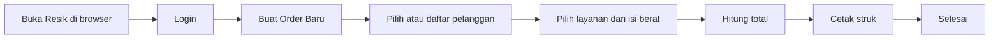
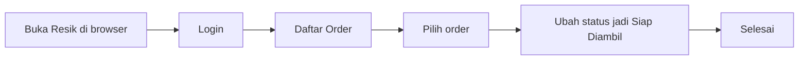
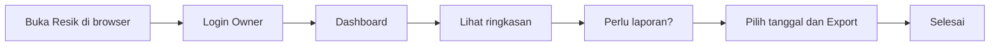

# Panduan Resik — Aplikasi Laundry untuk Pengguna

**Dokumentasi ini untuk pemilik laundry dan karyawan (kasir).** Ditulis dengan bahasa sederhana, tanpa istilah teknis.

---

## Apa itu Resik?

**Resik** adalah aplikasi untuk mengurus usaha laundry dari satu outlet. Dikembangkan dengan **Laravel** (backend API) dan **React** (frontend web). Bisa diakses lewat browser di HP, tablet, atau komputer. Dengan Resik Anda bisa:

- Mencatat order cucian baru dengan cepat  
- Menyimpan data pelanggan  
- Mencetak struk untuk pelanggan (bisa pakai QR untuk cek status)  
- Melihat pendapatan dan pengeluaran  
- Membuat laporan untuk keperluan arsip atau pajak  
- Login dengan password (aman di web)  

Data disimpan di server (backend Laravel). Frontend React diakses via browser. Bisa diperluas dengan PWA untuk akses offline di perangkat mobile jika diperlukan.

---

## Untuk siapa?

| Peran | Kegiatan sehari-hari |
| ----- | --------------------- |
| **Pemilik (Owner)** | Cek ringkasan usaha, lihat grafik pendapatan/pengeluaran, buat laporan periode, export ke PDF/Excel, atur jenis layanan dan harga. |
| **Kasir / Karyawan** | Login, buat order baru, cetak struk, ubah status order (misalnya jadi "siap diambil"), catat pengeluaran harian. |

---

## Apa saja yang bisa dilakukan?

- **Order baru:** input nama/telepon pelanggan, pilih layanan (cuci, setrika, kiloan, dll.), isi berat atau jumlah, sistem hitung total, cetak struk.  
- **Daftar order:** lihat semua order, filter menurut tanggal atau status, ubah status (diterima → cuci → setrika → siap diambil → diambil).  
- **Pelanggan:** simpan data pelanggan, lihat riwayat order per pelanggan.  
- **Pengeluaran:** catat pengeluaran harian (listrik, detergen, dll.) per kategori.  
- **Dashboard (owner):** ringkasan hari ini / minggu / bulan: jumlah order, pendapatan, pengeluaran, profit.  
- **Laporan:** laporan per periode, per layanan, atau per karyawan; export ke PDF atau Excel.  
- **Cetak:** struk untuk pelanggan, invoice, daftar harga.  
- **Notifikasi:** pengingat di dalam aplikasi (misalnya order siap diambil).  
- **WhatsApp:** link chat ke pelanggan (tanpa biaya tambahan).  
- **Fitur keren:** scan QR di struk untuk cek status order, tier member (Bronze/Silver/Gold), estimasi selesai pintar, dashboard live, analitik (jam sibuk, layanan laris), tema warna outlet, struk & invoice premium.  

### Fitur keren — apa itu?

Beberapa fitur tambahan yang bikin Resik beda dan nyaman dipakai:

- **QR di struk** — Pelanggan bisa scan QR untuk cek status order lewat browser, tanpa instal app.
- **Tier member** — Pelanggan bisa dapat level Bronze / Silver / Gold; makin sering order, makin dapat benefit (diskon atau prioritas).
- **Referral** — Pelanggan bisa kasih kode referral; pemilik bisa beri diskon atau poin untuk yang mengajak.
- **Ulang tahun pelanggan** — Sistem bisa ingat tanggal lahir dan kasih diskon atau ucapan di hari ulang tahun.
- **Estimasi pintar** — Sistem kasih perkiraan “Siap jam berapa” berdasarkan jenis layanan.
- **Antrian visual** — Daftar order tampil seperti kartu per status (diterima, cuci, setrika, siap diambil) supaya gampang dilihat.
- **Quick action** — Dari satu order bisa satu ketuk: cetak struk, ubah status “siap diambil”, atau buka chat WhatsApp ke pelanggan.
- **Dashboard live** — Ringkasan order dan pendapatan hari ini tampil langsung di layar utama.
- **Analitik** — Grafik jam sibuk, layanan paling laris, dan pelanggan paling aktif untuk bantu putuskan promo.
- **Tema & struk premium** — Warna bisa disesuaikan dengan branding outlet; struk dan invoice rapi, bisa pakai logo outlet.
- **Multi-bahasa** — Aplikasi bisa tampil dalam Bahasa Indonesia atau English.

Semua fitur di atas tidak pakai biaya langganan atau API berbayar.

---

## Cara pakai — langkah singkat

### Kasir: menerima order baru

1. Buka Resik di browser.  
2. Login dengan akun kasir.  
3. Pilih **Buat Order Baru**.  
4. Pilih pelanggan yang sudah terdaftar atau daftarkan pelanggan baru.  
5. Pilih jenis layanan (cuci, setrika, kiloan, dll.) dan isi berat atau jumlah.  
6. Sistem otomatis menghitung total bayar.  
7. Cetak struk dan berikan ke pelanggan.  
8. Selesai — order tercatat di sistem.

**Diagram alur:**

---

### Kasir: mengubah status order (misalnya “siap diambil”)

1. Buka Resik di browser dan login.  
2. Buka **Daftar Order**.  
3. Cari order yang sudah dicuci/disetrika.  
4. Ubah status menjadi **Siap Diambil**.  
5. Pelanggan bisa diberi tahu (notifikasi di app atau struk pengambilan).

**Diagram alur:**

---

### Owner: melihat ringkasan dan laporan

1. Buka Resik di browser dan login sebagai **Owner**.  
2. Buka **Dashboard** — di sini terlihat ringkasan hari ini (order, pendapatan, pengeluaran).  
3. Jika butuh laporan untuk periode tertentu (misalnya satu bulan): pilih tanggal, lalu **Export** ke PDF atau Excel.  
4. File laporan bisa disimpan untuk arsip atau keperluan lain.

**Diagram alur:**

---

## Pertanyaan yang sering diajukan

**Di mana data disimpan?**  
Data disimpan di server backend (Laravel) dengan database. Frontend React diakses lewat browser. Data bisa di-backup dengan export ke file (CSV/Excel).

**Bisa dipakai tanpa internet?**  
Aplikasi web membutuhkan koneksi internet untuk mengakses. Bisa diperluas menjadi PWA untuk mode offline jika diperlukan.

**Siapa yang bisa buat order dan cetak struk?**  
Semua karyawan yang punya akun kasir bisa. Owner bisa mengatur siapa saja yang punya akses.

**Bagaimana cara hubungi pelanggan lewat WhatsApp?**  
Di aplikasi ada opsi untuk membuka chat WhatsApp ke nomor pelanggan (link wa.me). Tidak perlu biaya tambahan untuk fitur ini.

**Apakah ada biaya langganan atau biaya API?**  
Tidak. Resik dirancang tanpa langganan API berbayar. Semua fitur di aplikasi tidak memakai layanan berbayar untuk operasional harian.

**Stack teknologi apa yang dipakai?**  
Backend: **Laravel** (PHP) untuk API, autentikasi, dan manajemen data. Frontend: **React** untuk antarmuka web yang responsif dan cepat.

---

## Ringkasan

- **Resik** = aplikasi web untuk mengurus laundry (order, pelanggan, struk, pengeluaran, laporan) plus **fitur keren** (QR status, tier member, estimasi pintar, analitik, tema premium).  
- Dipakai oleh **pemilik** dan **kasir/karyawan**.  
- Dibangun dengan **Laravel** (backend) + **React** (frontend); diakses lewat browser di berbagai perangkat.  
- **Tanpa biaya API** untuk fitur utama.  

Untuk pertanyaan teknis atau panduan instalasi, hubungi pengembang atau lihat dokumen teknis yang disediakan.
